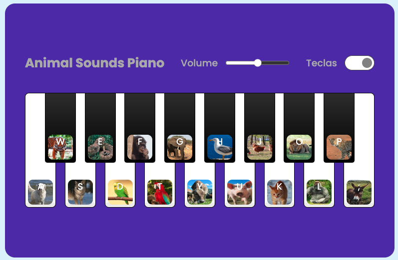

## Repositório para o Desafio de criar um piano do Bootcamp da Dio

### Desafio criado por <a href="https://github.com/felipeAguiarCode" target="_blank">@felipeAguiarCode</a>
- Ele implementou um teclado com sons de piano.

### Desafio respondido por <a href="https://github.com/alissonrangel" target="_blank">@alissonrangel</a>
- Eu troquei os sons de piano por sons de animais e coloquei as fotos de cada animal na respectiva tecla do som.
- Aumentei o tamanho das teclas pretas para ficar melhor de ver as imagens dos animais. 

### Imagem do teclado

